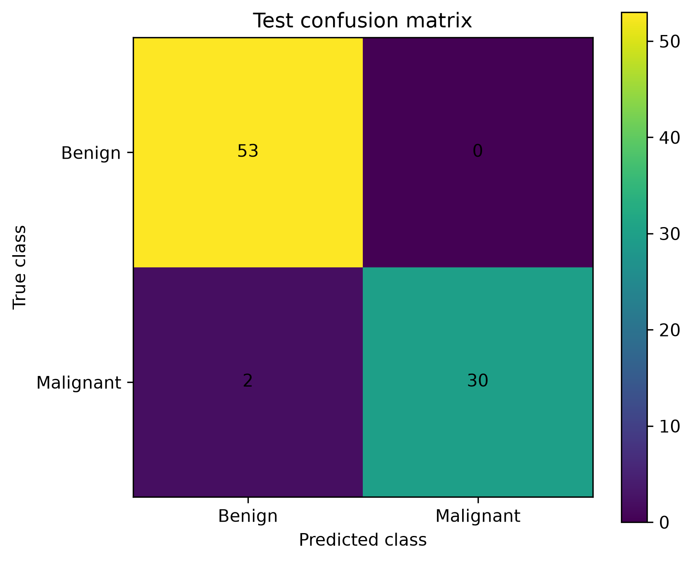
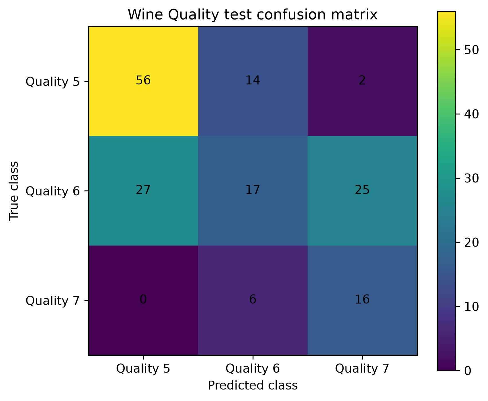

# Hybrid Quantum-Classical Classifier

Design, implementation and experimental evaluation of a hybrid quantum-classical machine learning system for tabular data classification using Qiskit.

This repository contains the practical development of the Bachelor's Degree Final Project:

**“Development of a Hybrid Quantum-Classical Learning System for Data Classification.”**

## Project overview

The project explores a hybrid machine learning architecture composed of:

* Classical data loading and preprocessing.
* Stratified train, validation and test partitions.
* Feature selection adapted to a four-qubit circuit.
* Quantum angle encoding.
* A parameterized variational quantum circuit.
* A classical output layer.
* Joint quantum-classical training.
* Comparison with classical machine learning classifiers.

The purpose of the project is not to demonstrate a general quantum advantage, but to evaluate the behaviour, limitations and practical viability of a hybrid quantum-classical model in a controlled classification environment.

## Datasets

Two public tabular datasets are used.

### Breast Cancer Wisconsin

* Binary classification problem.
* Target variable: `diagnosis`.
* Original labels:

  * `B`: benign.
  * `M`: malignant.
* Thirty numerical predictive features.
* Non-predictive columns removed:

  * `id`
  * `Unnamed: 32`

### Wine Quality

* Multiclass classification problem.
* Target variable: `quality`.
* Selected classes:

  * Quality 5.
  * Quality 6.
  * Quality 7.
* Eleven physicochemical predictive features.
* Non-predictive column removed:

  * `Id`

The original CSV files are not stored in the repository. They must be downloaded from Kaggle and placed in:

```text
data/raw/
```

using the following filenames:

```text
data/raw/breast_cancer.csv
data/raw/wine_quality.csv
```

Additional information about the datasets is available in `data/README.md`.

## Data preprocessing

The preprocessing pipeline currently includes:

1. Validation of the CSV structure.
2. Removal of identifier and empty columns.
3. Numerical transformation of the target labels.
4. Filtering of Wine Quality classes 5, 6 and 7.
5. Stratified dataset division:

   * 70% training.
   * 15% validation.
   * 15% testing.
6. Selection of the four most relevant features using `SelectKBest` with `f_classif`.
7. Standardization for classical machine learning models.
8. Angular scaling to the interval ([0,\pi]) for the quantum model.

All feature selectors and scalers are fitted exclusively on the training subset to prevent data leakage.

## Quantum circuit design

The implemented variational quantum circuit follows the architecture defined during the system design phase.

### Main configuration

* Number of qubits: 4.
* Number of input features: 4.
* Initial state: (|0000\rangle).
* Encoding method: angle encoding.
* Encoding gates: one (R_Y(x_i)) gate per qubit.
* Number of variational layers: 2.
* Trainable rotations:

  * (R_Y(\theta))
  * (R_Z(\phi))
* Entanglement pattern: circular CNOT topology.
* CNOT gates per layer: 4.
* Total trainable quantum parameters: 16.
* Total circuit parameters:

  * 4 input parameters.
  * 16 trainable parameters.

The circular entanglement pattern is:

```text
q0 → q1
q1 → q2
q2 → q3
q3 → q0
```

The same quantum core will be used for both datasets. The binary and multiclass problems will be handled through different classical output layers.

## Project structure

```text
hybrid-quantum-classical-classifier/
│
├── data/
│   ├── raw/
│   ├── processed/
│   └── README.md
│
├── notebooks/
│   └── 01_data_exploration.ipynb
│
├── results/
│   ├── figures/
│   └── metrics/
│
├── src/
│   ├── data/
│   │   ├── loaders.py
│   │   └── preprocessing.py
│   │
│   ├── evaluation/
│   ├── models/
│   ├── quantum/
│   │   └── circuit.py
│   │
│   └── training/
│
├── tests/
│   ├── check_environment.py
│   ├── test_data_loaders.py
│   ├── test_preprocessing.py
│   └── test_quantum_circuit.py
│
├── .gitignore
├── README.md
└── requirements.txt
```

## Installation

Clone or download the project and create a virtual environment:

```powershell
python -m venv .venv
```

Activate the environment on Windows:

```powershell
.\.venv\Scripts\Activate.ps1
```

Install the dependencies:

```powershell
python -m pip install --upgrade pip
pip install -r requirements.txt
```

## Running the tests

All automated tests can be executed from the project root:

```powershell
python -m pytest -v
```

The current test suite validates:

* Dataset loading.
* Dataset schema validation.
* Removal of non-predictive columns.
* Target label encoding.
* Wine Quality class filtering.
* Stratified dataset splitting.
* Feature selection.
* Classical and quantum scaling.
* Reproducibility of the preprocessing pipeline.
* Number of circuit qubits and parameters.
* Quantum gate counts.
* Complete parameter assignment.
* Rejection of invalid circuit configurations.

## Current implementation status

### Completed

* [x] Local development environment.
* [x] Qiskit environment validation.
* [x] Initial dataset exploration.
* [x] Dataset loading and cleaning.
* [x] Binary and multiclass target encoding.
* [x] Stratified train, validation and test partitioning.
* [x] Selection of four predictive features.
* [x] Classical feature standardization.
* [x] Quantum angular scaling.
* [x] Four-qubit angle encoding circuit.
* [x] Two-layer variational ansatz.
* [x] Circular CNOT entanglement.
* [x] Automated tests for data and circuit components
* [x] Definition of Pauli-(Z) observables.
* [x] Construction of the quantum neural network.
* [x] Integration with the classical output layer.
* [x] Binary hybrid classifier.
* [x] Multiclass hybrid classifier.
* [x] Joint quantum-classical training.
* [x] Early stopping and experiment tracking.
* [x] Classical baseline models.
* [x] Final evaluation and comparison.
* [x] Generation of figures and result tables.

## Technologies

* Python
* Qiskit
* Qiskit Aer
* Qiskit Machine Learning
* NumPy
* Pandas
* scikit-learn
* PyTorch
* Matplotlib
* Pytest
* Jupyter
* Visual Studio Code

## Reproducibility

The project uses controlled random seeds for:

* Dataset splitting.
* Parameter initialization.
* Experimental repetitions.

The training, validation and test partitions will remain identical across the hybrid and classical models to ensure a fair comparison.


## Running the experiments

All commands must be executed from the project root.

### Hybrid binary classification

```bash
python experiments/run_breast_cancer.py --seed 42 --split-seed 42

### Hybrid multiclass classification

python experiments/run_wine_quality.py --seed 42 --split-seed 42

### Classical baselines

The supported models are logistic_regression, rbf_svm and mlp.

python experiments/run_classical_baseline.py \
  --dataset breast_cancer \
  --model logistic_regression \
  --seed 42 \
  --split-seed 42
python experiments/run_classical_baseline.py \
  --dataset wine_quality \
  --model rbf_svm \
  --seed 42 \
  --split-seed 42

### Result summaries
python experiments/summarize_breast_cancer.py
python experiments/summarize_wine_quality.py
python experiments/summarize_classical_baselines.py

### Quantum circuit figure
python experiments/draw_quantum_circuit.py

Los parámetros `--dataset`, `--model`, `--seed` y `--split-seed` corresponden a los que admite actualmente el ejecutor de modelos clásicos; `run_wine_quality.py` también admite las semillas y parámetros de entrenamiento documentados. :contentReference[oaicite:10]{index=10}


## Example results

<p align="center">
  
  
</p>

## Author

**Carla Martínez Alonso**

Bachelor's Degree in Computer Engineering
Universidad Alfonso X el Sabio
Final Degree Project — July 2026
